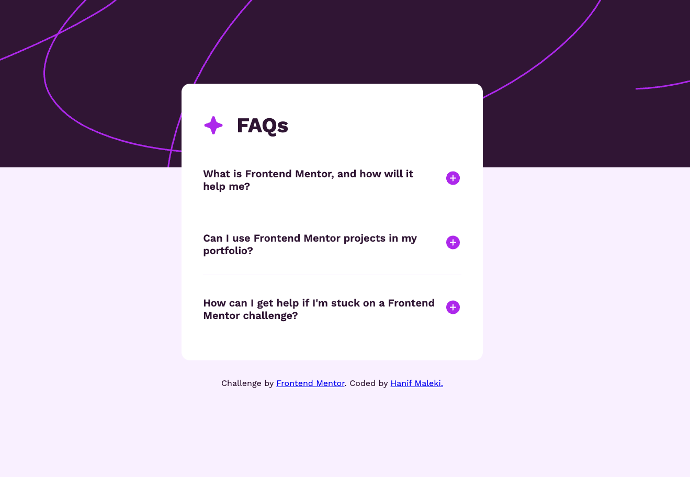

# Frontend Mentor - FAQ accordion solution

This is a solution to the [FAQ accordion challenge on Frontend Mentor](https://www.frontendmentor.io/challenges/faq-accordion-wyfFdeBwBz). Frontend Mentor challenges help you improve your coding skills by building realistic projects. 

## Table of contents

- [Overview](#overview)
  - [The challenge](#the-challenge)
  - [Screenshot](#screenshot)
  - [Links](#links)
- [My process](#my-process)
  - [Built with](#built-with)
  - [What I learned](#what-i-learned)
  - [Continued development](#continued-development)
  - [Useful resources](#useful-resources)
- [Author](#author)

## Overview

### The challenge

Users should be able to:

- Hide/Show the answer to a question when the question is clicked
- Navigate the questions and hide/show answers using keyboard navigation alone
- View the optimal layout for the interface depending on their device's screen size
- See hover and focus states for all interactive elements on the page

### Screenshot



### Links

- Solution URL: [Solution URL](https://github.com/hanifmaleki/Faq-Accordion)
- Live Site URL: [Live site URL](https://hanifmaleki.github.io/Faq-Accordion/)

## My process

### Built with
- Semantic **HTML5** markup  
- **CSS custom properties**  
- **Flexbox**  
- **CSS Grid**  
- **Mobile-first workflow**  
- **Pug** template language  
- **SCSS** (with variables and mixins)  
- **GitHub Actions** (for CI/CD pipeline)  
- **GitHub Pages** (for deployment)  
- **Neovim** (as main editor)  
- **npm scripts** (`watch`, `copy-js`)  

### What I learned
- How to create reusable **Pug mixins** for components (e.g., FAQ items):

```pug
mixin faq(question, answer)
    .faq-container 
        .faq-question-row-container
            .faq-question= question 
            .faq-expand-button
                include ../svg/icon-plus.pug
            .faq-close-button
                include ../svg/icon-minus.pug

        .faq-answer= answer 
```

- How to structure SCSS in a modular way (using variables and separate files):
```scss
.faq-container {
    display: flex;
    flex-direction: column;
    gap: 2rem;
    padding-block-start: calc(0rem + 1vw);
    padding-block-end: calc(1rem + 1vw);
}

.faq-question-row-container {
    display: flex;
    align-items: center;
    gap: 1rem;

    :hover {
        color: variables.$violet;
        cursor: pointer;
    }
}

.faq-question {
    flex: 1;
    font-size: variables.$fs-xl;
    font-weight: 600;
}

.faq-expand-button, .faq-close-button {
    align-content: center;
    flex: 0 0 2rem;

    svg {
        width: 100%;
    }

    &.hide {
        display: none;
    }

    &.show {
        display: block;
    }
}
```

- How to build a vanilla JavaScript class to handle interactive FAQ items:
```js
class FaqItem {
    constructor(container) {
        this.element = container
        this.expandButton = container.querySelector('.faq-expand-button')
        this.closeButton = container.querySelector('.faq-close-button')
        this.answer = container.querySelector('.faq-answer')
        this.faqQuestionRowContainer = container.querySelector('.faq-question-row-container')
        this.isExpanded = false

        this.faqQuestionRowContainer.addEventListener('click', event => this.toggleExpansion())
        this.expandButton.addEventListener('click', event => this.expand(event))
        this.closeButton.addEventListener('click', event => this.close(event))
    }

    toggleExpansion() {
        if (this.isExpanded) {
            this.close()
        } else {
            this.expand()
        }

        this.isExpanded = !this.isExpanded
    }

    expand() {
        this.answer.classList.add('show')
        this.closeButton.classList.add('show')
        this.expandButton.classList.add('hide')
    }

    close() {
        this.answer.classList.remove('show')
        this.closeButton.classList.remove('show')
        this.expandButton.classList.remove('hide')
    }
}
```

This component is easily used in template:

```pug
include mixins/faq.pug

+faq(
    'What is Frontend Mentor, and how will it help me?',
    `Frontend Mentor offers realistic coding challenges to help developers improve their 
    frontend coding skills with projects in HTML, CSS, and JavaScript. It\'s suitable for
    all levels and ideal for portfolio building.`
)
```

### Continued development
In the next project, I want to explore **internationalization (i18n)** to avoid hardcoding text directly in templates. This will make projects more adaptable to multiple languages 
and prepare me for real-world multilingual applications.

## Author

- Frontend Mentor - [@hanifmaleki](https://www.frontendmentor.io/profile/hanifmaleki)

